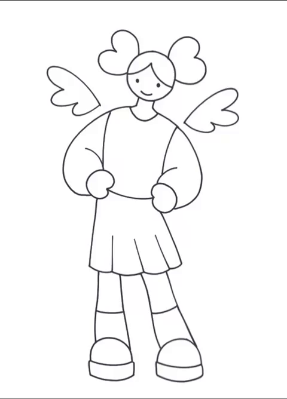
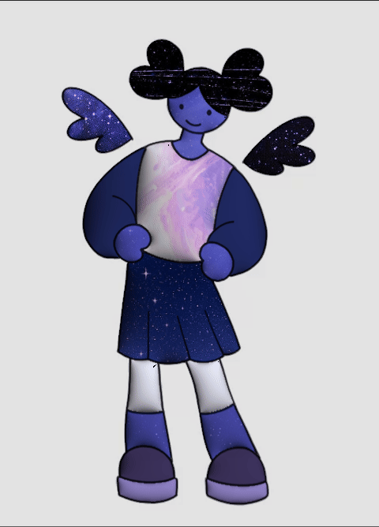
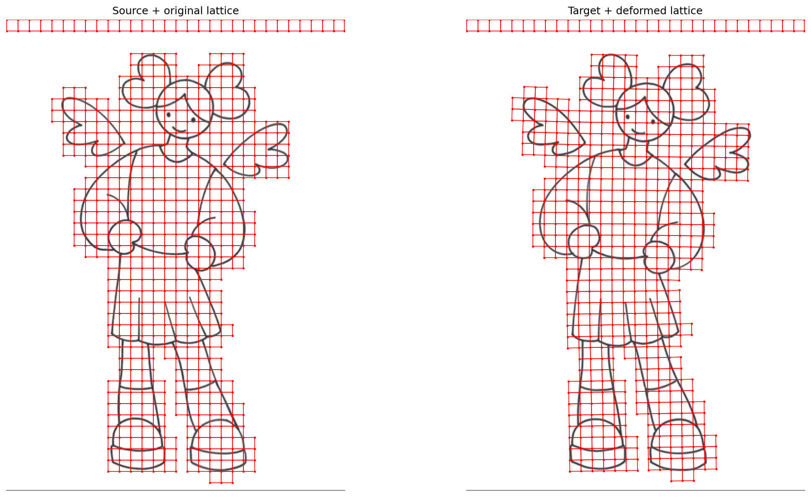
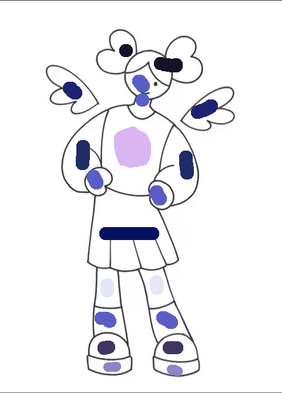
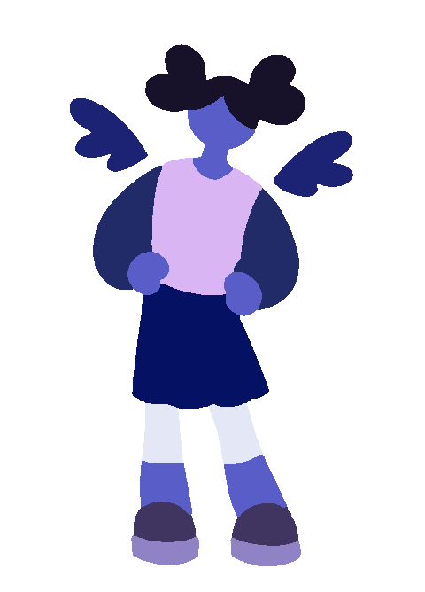
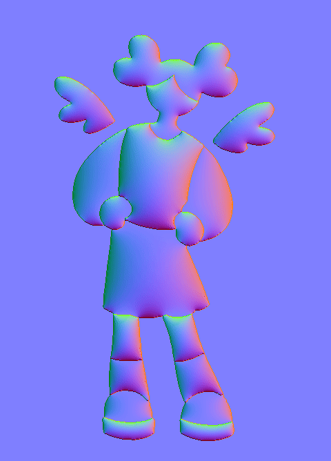
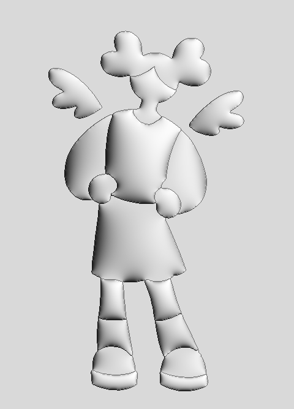

# CS2240 Final Project: The Shady Guys
### Muhamed Ka, Noma Vu, Brian Xu

Based on [TexToons: Practical Texture Mapping for Hand-drawn Cartoon Animations](https://dcgi.felk.cvut.cz/home/sykorad/Sykora11-NPAR.pdf) by Sýkora et al.

presentation slides: [link](https://docs.google.com/presentation/d/1RwyPLEgUUHKUDBD-g4IZJ5uEqJ56R0jE_0GbFs9ML-w/edit?slide=id.g3def91d2dfb_0_256#slide=id.g3def91d2dfb_0_256)

## Results

### Input + Results

| Original Animation    | Final Result          |
| --------------------- | --------------------- |
|  |  |

### ARAP Image Deformation

### LazyBrush Scribbles + Segmentation

| Scribbles (warped)        | Segmentations                |
| ------------------------- | ---------------------------- |
|  |  |

### Normals + Shading

| Normals                | Shading                 |
| ---------------------- | ----------------------- |
|  |  |
